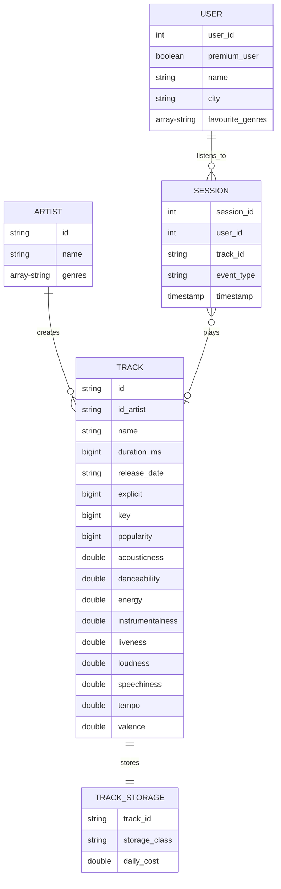

**Artists**
- GENRES - array<string>
- ID - string
- NAME - string

**Sessions** 
- EVENT_TYPE - string
- SESSION_ID - bigint
- TIMESTAMP - string
- TRACK_ID - string
- USER_ID - bigint

**Track Storage**
- DAILY_COST - double
- STORAGE_CLASS - string
- TRACK_ID - string

**Tracks**
- ACOUSTICNESS - double
- DANCEABILITY - double
- DURATION_MS - bigint
- ENERGY - double
- EXPLICIT - bigint
- ID - string
- ID_ARTIST - string
- INSTRUMENTALNESS - double
- KEY - bigint
- LIVENESS - double
- LOUDNESS - double
- NAME - string
- POPULARITY - bigint
- RELEASE_DATE - string
- SPEECHINESS - double
- TEMPO - double
- VALENCE - double

**Users**
- CITY - string
- FAVOURITE_GENRES - array<string>
- NAME - string
- PREMIUM_USER - boolean
- STREET - string
- USER_ID - bigint

